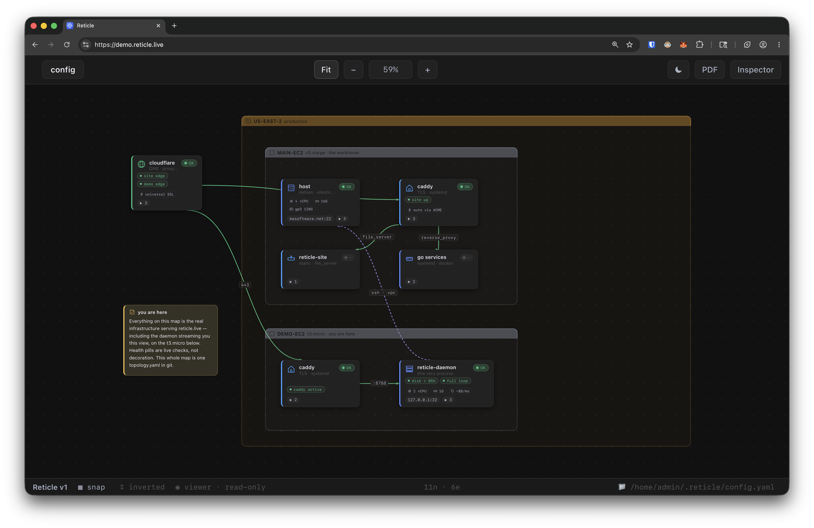
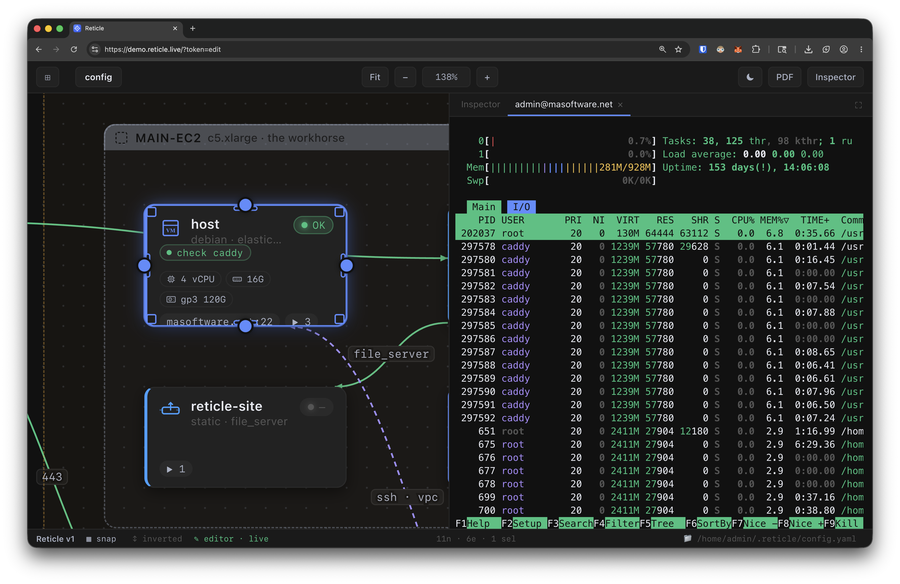
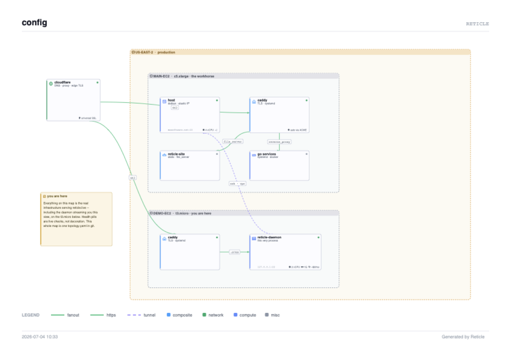

<div align="center">


# Reticle

**The infrastructure diagram you can operate.**

Draw your real topology on an infinite canvas, then watch it breathe.
Live health on every node, a real SSH terminal one keypress away,
and print-quality PDF export. Everything is one git-diffable YAML file.

No accounts. No cloud. No lock-in.

[**⬇ Download**](https://github.com/mannders00/reticle/releases/latest) · [**Live demo**](https://demo.reticle.live) · [**Team daemon →**](https://reticle.live)

MIT-licensed desktop app · macOS / Linux / Windows

<br/>



</div>

---

## Your diagram, but it does something

Every box on that map is a real machine. The health pills are live checks,
not decoration. And when something goes red:



Select the node and hit <kbd>⌘⏎</kbd>. A **real SSH shell** opens right there.
No copy-pasting hostnames into another terminal. The diagram *is* the
operational surface:

- **Actions**: named scripts on any node, one click, output on the map
  (`df -h`, `journalctl -u api -n 80`, `kubectl rollout status`, yours)
- **Checks**: scheduled crons per node. SSH scripts, local CLI calls
  (`aws`, `dig`, anything), or HTTP probes with status + `jq` assertions.
  A failing check turns its node red and tells you *which* check, on the card
- **Terminals**: full xterm over SSH or `kubectl exec`, docked next to the map
- **Everything in one YAML**: positions, edges, checks, notes. Commit it
  next to your infra code; review topology changes in pull requests

Reticle uses **your** `ssh`, **your** `kubectl`, **your** keys and
kubeconfig, exactly like your terminal does. No credentials are ever
stored, asked for, or sent anywhere.

## Hand the map to anyone

Export the whole canvas as a **vector PDF**: kind icons, health states,
edge styles, legend, wrapped notes. Attach it to the postmortem, drop it
in the customer deck, print it:

<div align="center">
<a href="assets/demo-pdf.pdf"></a>

<sub>That's a real export. <a href="assets/demo-pdf.pdf">Open the PDF</a>.</sub>
</div>

## Get it

**[Download the latest release](https://github.com/mannders00/reticle/releases/latest)**: .dmg (macOS, Apple Silicon + Intel), .AppImage/.deb/.rpm (Linux), .msi/.exe (Windows).

> macOS builds are unsigned for now: right-click → Open the first time.
> Windows: interactive terminals aren't supported yet. Actions, checks,
> health, and PDF export all work.

Or build from source (Rust + [Bun](https://bun.sh)):

```sh
git clone https://github.com/mannders00/reticle
cd reticle
bun install
bun run tauri build   # or: bun run tauri dev
```

Try it with a sample: the app ships five worked topologies (homelab to
enterprise) in the workspace switcher, or start from
[`topology.yaml.example`](topology.yaml.example).

## Share it live with your whole team

The desktop app is yours, free, forever. When the *team* needs the map,
there's the **[Reticle team daemon](https://reticle.live)**, a single
~4 MB binary that serves this exact app to every browser on your network:

- Nothing to install for teammates, just a browser and a link
- Checks run 24/7 on the daemon; **everyone sees live health**, even viewers
- **Read-only by default**: strict editor/viewer tokens, enforced server-side
- Credentials stay on one host; nobody distributes SSH keys
- Optional JSONL audit log of who ran what

The live demo at **[demo.reticle.live](https://demo.reticle.live)** is the
daemon serving its own real infrastructure, read-only. Go poke it.

## Documentation

| | |
|---|---|
| [Getting started](docs/getting-started.md) | Install, first map, where things live |
| [Topology reference](docs/topology-reference.md) | Every field of the YAML: kinds, specs, checks, health, edges, add-ons |
| [Keyboard shortcuts](docs/shortcuts.md) | Canvas, editing, and operating keys |
| [The team daemon](docs/daemon.md) | Flags, the access model, audit log, deployment |
| [DAEMON.md](DAEMON.md) | Full architecture and wire protocol |
| [Contributing](CONTRIBUTING.md) · [Security policy](SECURITY.md) | |

## Repo layout

```
src/          the frontend (vanilla ESM + SVG, no framework, no build step)
core/         reticle-core: shared Rust domain modules (config, ssh, health,
              cron scheduler, pty terminals, file watcher)
src-tauri/    desktop shell (Tauri 2)
web/          the reticle.live site (static)
DAEMON.md     team-daemon design: sharing model, roles, wire protocol
```

## License

Everything in this repository is **[MIT](LICENSE)**. The team daemon is a
separate commercial binary; see [reticle.live](https://reticle.live).
