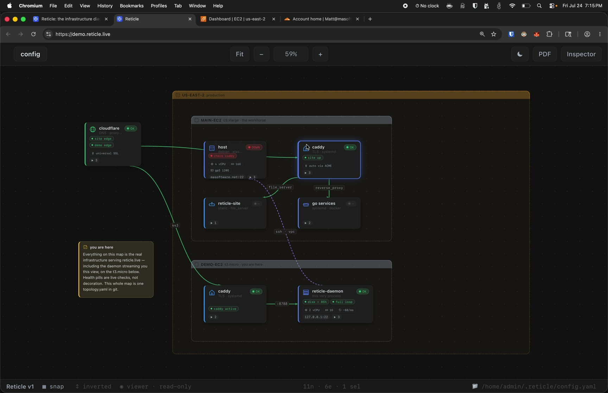
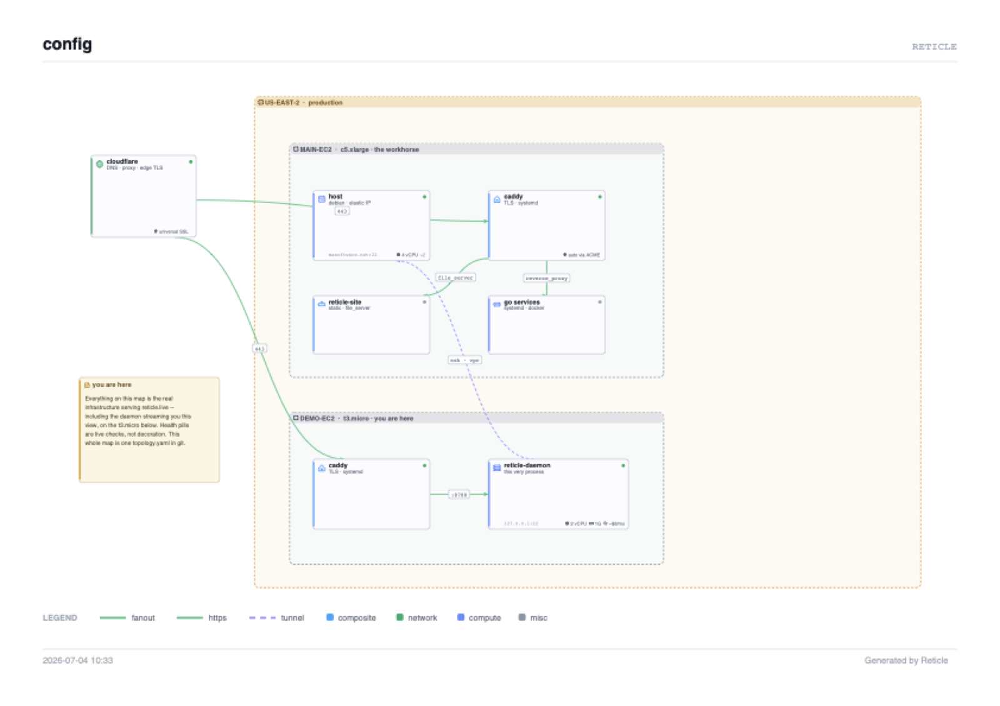

<div align="center">


# Reticle

**The live operational graph for humans, APIs, and agents.**

Reticle keeps topology, health, dependencies, and freshness in one live picture
for daily work and incidents, before anyone touches production.

[**↓ Download free Desktop**](https://github.com/mannders00/reticle/releases/latest) · [**Live demo**](https://demo.reticle.live) · [**Discord**](https://discord.gg/x6hY9GYyph) · [**Team Daemon →**](https://reticle.live/team/)

MIT-licensed desktop app · macOS / Linux / Windows

</div>

## One graph, one YAML, local first

The same simple YAML defines the graph in Desktop and Team Daemon. Keep it in
Git and run Reticle on your own machine or infrastructure: no SaaS account,
forced cloud sync, or separate diagram format.

| Reticle Desktop | Reticle Team Daemon |
|---|---|
| **Open source and local first.** For homelabs, solo operations, and evaluation. The app, YAML, and observations stay on your machine. | **Self-hosted and team focused.** Runs inside your environment and serves the same graph through the browser UI, authenticated JSON API, and read-only MCP for agents. |

**Inspection comes before action.** MCP is read-only by design, so agents can
inspect current context without gaining shell or action access.

<div align="center">

<br/>


<br/><br/>

[](web/assets/reticle-demo.mp4)

**[▶ Watch the two-minute demo](web/assets/reticle-demo.mp4)** — draw the map → attach real hosts → checks go live → export the PDF

</div>

---

## One current picture during an incident

Every box is connected to current evidence. When something goes red, operators
and tools can inspect the same topology, observation times, and configured
context instead of reconciling a stale diagram, a dashboard, and terminal
folklore.

The YAML configuration is authoritative. Runtime health is a timestamped,
ephemeral observation, not a replacement for metrics, logs, or durable history.

- **Current snapshot**: normalized nodes, edges, timestamped signals, collector
  state, and named-action descriptors, assembled in the shared Rust core
- **Safe collector defaults**: static YAML topology, HTTP status/JSON assertions,
  and fixed read-only SSH probes for uptime or systemd service state
- **Gated custom checks**: UI-created remote `ssh.command` and local
  `shell.command` checks default to enabled and viewer-visible, but execute only
  while privileged mode is active. Team additionally requires daemon operator
  `--allow-custom-commands` and editor authorization to manage definitions
- **Guarded actions**: persisted secure-shell or local-shell commands with bounded
  execution, optional signal preconditions, approval by default, editor-only
  invocation, and daemon audit logging. Team callers submit only a stable action
  ID, expected configuration revision, and approval decision
- **Shared consumers**: the UI, `GET /api/graph`, and read-only MCP tools read
  the same snapshot
- **Local-only Desktop**: commit topology beside infrastructure code and review
  it in pull requests. Credentials stay in your existing SSH configuration

## Safe by default, precise when you choose

Reticle starts with fixed, read-only evidence: HTTP status and JSON assertions,
host uptime, and systemd service state. That is enough for many maps and remains
the default for every workspace and Team daemon.

When a fixed probe cannot express the exact question, an operator can explicitly
enable the Desktop's single global **privileged mode** control. For the active
workspace, it unlocks all persisted remote SSH and local shell checks,
so the same one-liners already used during diagnosis can become named, repeatable
signals: `curl` plus `jq`, `systemctl status`, release/version assertions, queue
depth checks, certificate inspection, or a tightly scoped diagnostic script.
The shell makes the check model deliberately flexible; it also makes these checks
arbitrary commands, not inherently read-only operations.

The escalation is intentionally visible:

- Desktop has one bottom-status-bar privileged toggle, not a per-check risk
  acknowledgment. Its trust applies to all custom checks and actions in the
  active workspace for the current app session and can be revoked without restarting.
- Team requires the daemon operator's `--allow-custom-commands` flag and an editor.
- New custom checks default to enabled and viewer-visible; the form keeps the
  command-risk warning visible without adding another acknowledgment gate.
- Non-interactive checks have bounded time and output; SSH checks receive no PTY or stdin.
- Named actions require approval by default and may require a fresh signal state.
- Desktop can open a separately warned live SSH/kubectl shell for the local operator.
- Team viewers see the resulting graph evidence, but not command text, edit controls,
  action controls, or an interactive shell. JSON, MCP, and chat remain read-only.

Use restricted SSH principals and a least-privileged Desktop/daemon OS account.
Reticle's warnings and timeouts are guardrails; the operating-system and remote
identity permissions remain the real security boundary.

## Reduce the cost of ambiguity

The expensive part of incident response is rarely typing the command. It is
understanding what is happening, recovering the relevant change context, and
deciding what is safe. Reticle is designed to help teams improve:

- **Time to understand an incident**: orient around topology, dependencies,
  current evidence, and freshness instead of reconstructing the system aloud.
- **Time to safe next action**: connect evidence to bounded, preconfigured
  responses with explicit preconditions and approval.
- **Failed-deployment recovery time**: keep the affected service, dependencies,
  signals, and available response in one operating context.
- **Change-context latency**: make the reason and surrounding system state easier
  to recover when the original author is not present.
- **Operational handoff time**: give the next shift or escalation path the same
  live graph instead of a partial verbal summary.
- **Operational context**: preserve context in topology, JSONL audit records,
  and exported incident snapshots.

These are outcomes Reticle helps move by reducing incident ambiguity; they are
not fixed ROI promises.

| | Free Desktop | [Team Daemon](https://reticle.live/team/) |
|---|---|---|
| Best for | Individuals and homelabs | Teams sharing one operational view |
| Runtime | Standalone, local-only | Shared, always-on daemon with browser access |
| API and MCP | Loopback JSON API and read-only MCP | Authenticated JSON API and read-only MCP |
| Audit logging | Not a shared service | Configurable JSONL audit log |
| Price | Free and MIT licensed | $199/month or $1,999/year per daemon |

## Hand the map to anyone

Export the whole canvas as a **vector PDF**: kind icons, health states,
edge styles, legend, wrapped notes. Attach it to the postmortem, drop it
in the customer deck, print it:

<div align="center">
<a href="assets/demo-pdf.pdf"></a>

<sub>That's a real export. <a href="assets/demo-pdf.pdf">Open the PDF</a>.</sub>
</div>

## Get it

**[Download the latest release](https://github.com/mannders00/reticle/releases/latest)**: .dmg (macOS, Apple Silicon + Intel), .AppImage/.deb/.rpm (Linux), .msi/.exe (Windows).

> macOS builds are unsigned for now: right-click → Open the first time.
> SSH actions require a configured SSH target and privileged mode. Fixed checks, graph inspection,
> and PDF export work without enabling an action.

Or build from source (Rust + [Bun](https://bun.sh)):

```sh
git clone https://github.com/mannders00/reticle
cd reticle
bun install
bun run tauri build   # or: bun run tauri dev
```

Try it with a sample: the app ships six visual topology templates (homelab to
enterprise) in the workspace switcher. The Reticle deployment sample includes
live public HTTP collectors; adapt the others to your own endpoints, or start from
[`topology.yaml.example`](topology.yaml.example).

## Query your desktop graph locally

The OSS desktop includes an opt-in, loopback-only JSON API and read-only MCP
server. It is disabled by default and never binds beyond `127.0.0.1`:

```sh
make desktop-api-dev
curl http://127.0.0.1:8786/api/graph
```

MCP is available at `POST http://127.0.0.1:8786/mcp` with
`reticle_get_graph` and `reticle_get_node`. There are no local or daemon MCP
action tools. Set `RETICLE_DESKTOP_HTTP_PORT` to choose another port.

## Share it live with your whole team

The desktop app is yours, free, forever. When the *team* needs the map,
there's the **[Reticle Team Daemon](https://reticle.live/team/)**, a single
binary that serves this exact app to every browser on your network:

- Nothing to install for teammates, just a browser and a link
- Always-on collection from one shared network vantage point
- **Read-only by default**: strict editor/viewer tokens, enforced server-side
- Credentials stay on one host; nobody distributes SSH keys
- Configured JSONL audit logging for connection lifecycle, selected privileged
  requests and refusals, save failures, and named-action outcomes
- Optional editor-authorized, read-only chat lens with request-scoped credentials
- Optional custom command checks gated by `--allow-custom-commands`; UI/API
  definitions require editor authorization and default to enabled and viewer-visible

The live demo at **[demo.reticle.live](https://demo.reticle.live)** is the
daemon serving its own real infrastructure, read-only. Go poke it.

Custom checks are arbitrary commands and cannot be guaranteed read-only.
`ssh.command` runs remotely without a PTY or stdin; `shell.command` runs through
non-interactive Bash on a Unix Desktop or daemon host. Neither is exposed as a
viewer graph API, MCP, chat, or one-off ad-hoc tool.
Viewers cannot see command text, manage definitions, or run checks, and command
text is not written to audit logs. Use restricted SSH principals and run Reticle
itself as a dedicated, least-privileged OS account. Named actions use the same
SSH/host execution boundary and remain persisted definitions, never ad-hoc
requests. Team invocation includes the action ID, expected configuration
revision, and approval decision.

Desktop does not execute persisted shell commands merely by opening a YAML file.
Use the one **Enable privileged mode** control in the bottom status bar to trust
all custom checks and actions in the selected workspace for the current app
session; there is no per-check acknowledgment. Turn it off there to revoke trust
and close operator shells. Managed deployments may instead launch with
`RETICLE_ALLOW_CUSTOM_COMMANDS=1`, a process-wide override that trusts every YAML
opened by that Desktop process. The loopback JSON/MCP server and chat lens never
initiate persisted shell commands.

The [Team Daemon](https://reticle.live/team/) is **$199/month or $1,999/year
per daemon**. White-glove installation and operational mapping starts at
**$3,000 one-time**.

## Optional chat lens

The optional chat panel can use OpenAI or a loopback Ollama instance to answer
questions from the current graph. It is a read-only lens, not the product or an
authoritative system. It receives only read-only graph inspection tools and cannot
save topology, open a shell, or run a named action.
OpenAI keys are request-scoped, sent to the daemon when applicable and then to
OpenAI's official API, and are never persisted or logged. Ollama endpoints are
restricted to `localhost` or literal loopback IPs.

## Documentation

| | |
|---|---|
| [Getting started](docs/getting-started.md) | Install, first map, where things live |
| [Topology reference](docs/topology-reference.md) | Every field of the YAML: kinds, specs, checks, health, edges, add-ons |
| [Operational graph](docs/operational-graph.md) | Canonical schema, collectors, named actions, JSON API, and MCP |
| [Keyboard shortcuts](docs/shortcuts.md) | Canvas, editing, and operating keys |
| [The Team Daemon](https://reticle.live/team/) | Pricing, licensing, and team deployment |
| [Daemon operations](docs/daemon.md) | Flags, access model, audit log, deployment |
| [v1.2 release and migration](docs/release-notes-v1.2.md) | Behavior changes and upgrade checklist |
| [Capabilities and limitations](docs/capabilities-and-limitations.md) | Current product boundary and unsupported claims |
| [Production deployment](docs/production-deployment.md) | Linux, systemd, Caddy, rotation, backup, and rollback |
| [DAEMON.md](DAEMON.md) | Full architecture and wire protocol |
| [Contributing](CONTRIBUTING.md) · [Security policy](SECURITY.md) · [Discord](https://discord.gg/x6hY9GYyph) | |

## Repo layout

```
src/          the frontend (vanilla ESM + SVG, no framework, no build step)
core/         reticle-core: shared graph, collectors, named actions, config
src-tauri/    desktop shell and opt-in loopback read API (Tauri 2)
web/          the reticle.live site (static)
DAEMON.md     team-daemon design: sharing model, roles, wire protocol
```

## License

The Desktop, shared core, frontend, and their documentation are provided under
the repository **[MIT license](LICENSE)**. The `daemon/` directory is expressly
excluded and is proprietary commercial software governed by
the Team license distributed with it and the applicable Team agreement. An MIT
Desktop release does not grant a right to use or distribute Team Daemon.
