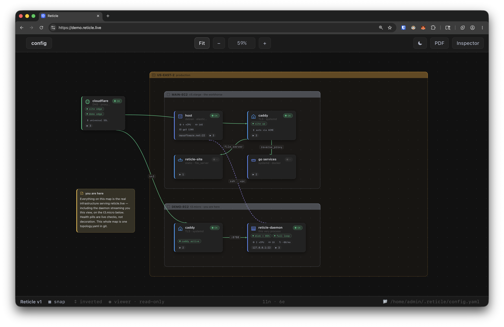

<div align="center">


# Reticle

**The infrastructure diagram you can operate.**

Reticle lets you intentionally map the systems and relationships you actually
reason about, keep the diagram in Git as one YAML file, and connect it to current
health checks, notes, and guarded actions.

It is not an auto-discovered inventory of every pod, process, socket, and volume.
You decide what belongs in the operating model; Reticle keeps that model
connected to reality.

[**Download free Desktop**](https://github.com/mannders00/reticle/releases/latest) · [**Explore the live demo**](https://demo.reticle.live) · [**Reticle Team Daemon**](https://reticle.live/team/)

MIT-licensed Desktop · macOS / Linux / Windows

<br/>



</div>

## A diagramming tool first, with reality attached

**Reticle starts with the infrastructure diagram your team would make anyway.**

The useful map is an expression of intent, not a dump of runtime objects. Reticle
is a purpose-built diagramming app for laying out the services, boundaries,
relationships, and context that form your team's mental model. Then it connects
that same hand-authored diagram to live systems.

- **Diagramming that stands on its own:** arrange architecture freely, add the
  context people need, and refine the model visually without surrendering the
  canvas to generated inventory.
- **Reality on the same canvas:** attach HTTP, fixed SSH, and explicitly enabled
  custom checks. Health and observation times appear where your team already
  looks to understand the system.
- **One portable model:** edit visually or in YAML, keep it in Git, export it as
  PDF, or inspect the same graph through local JSON and read-only MCP.

The YAML configuration is authoritative. Runtime health is a timestamped,
ephemeral observation. Reticle complements metrics, logs, traces, alerting, and
durable history; it does not replace them.

## Download and quick start

[Download the latest Desktop release](https://github.com/mannders00/reticle/releases/latest):
`.dmg` for macOS, `.AppImage`/`.deb`/`.rpm` for Linux, or `.msi`/`.exe` for Windows.

> macOS builds are currently unsigned. Right-click the app and choose Open the
> first time.

1. Open Reticle and choose a bundled sample or **New workspace**.
2. Drag services and boundaries onto the canvas, then connect them.
3. Save the YAML beside your infrastructure code and add a fixed health check.

Desktop supports multiple local workspaces. It is standalone and local-only;
there is no account or Reticle cloud service.

## Draw, connect, inspect

### 1. Draw the operating model

Map the architecture people actually reason about. Add service ownership notes,
runbooks, boundaries, and dependencies without trying to enumerate every runtime
resource.

### 2. Connect it to current evidence

Start with HTTP status/JSON checks and fixed, read-only SSH probes for host uptime
and systemd service state. Custom remote SSH and Unix-only local Bash checks are
available only after explicit privileged configuration.

### 3. Inspect before acting

Select a failing service to see its relationships, current evidence, and freshness.
Export the whole diagram as a vector PDF or use a persisted, guarded named action
when a human operator decides to proceed.

## Free Desktop and Team Daemon

| | Free Desktop | [Team Daemon](https://reticle.live/team/) |
|---|---|---|
| Best for | Homelabs, enthusiasts, solo operators, evaluation | Organizations sharing one always-on diagram |
| Deployment | Free, MIT-licensed, standalone, local-only | Commercial, customer-hosted, always on |
| Scope | Multiple local workspaces | One topology per licensed daemon |
| Access | One local operator | Unlimited browser seats; shared viewer/editor bearer tokens |
| Integrations | Opt-in loopback JSON and read-only MCP | Authenticated JSON and read-only MCP |
| Audit | Not a shared service | Configurable JSONL logging; off unless configured |
| Price | Free | $199/month or $1,999/year per running daemon |

Team keeps collection running when a laptop closes, centralizes credentials on
one managed host, and serves authorized browsers and integrations from one network
vantage point. SSO, individual identity, per-user attribution, built-in high
availability, and a default SLA are not included.

White-glove Team deployment and initial mapping starts at **$3,000 one-time**.

## Safety and product boundaries

- Fixed HTTP and read-only SSH probes are the safe defaults.
- Custom command checks are arbitrary commands. Desktop requires its global
  privileged toggle; Team requires `--allow-custom-commands` and editor access.
- Named actions are persisted, server-owned definitions. Callers do not submit
  arbitrary command text.
- MCP has no shell, mutation, command, or named-action tools. Team has no browser
  terminal or ad-hoc shell.
- The Desktop/daemon OS identity and restricted SSH principal remain the real
  execution boundary.
- Reticle does not auto-discover infrastructure and is not an autonomous
  remediation system.

Read the full [capabilities and limitations](docs/capabilities-and-limitations.md),
[security policy](SECURITY.md), and [Team operations guide](docs/daemon.md).

## Local JSON and MCP

Desktop can expose the current graph to local integrations through an opt-in,
loopback-only server. It is disabled during normal startup.

```sh
make desktop-api-dev
curl http://127.0.0.1:8786/api/graph
```

MCP is available at `POST http://127.0.0.1:8786/mcp` with read-only graph and
node inspection tools. See [Operational graph](docs/operational-graph.md).

## Why machine-readable topology matters

A July 2026 Dynatrace Research preprint evaluated 248 controlled Kubernetes
security-patching trials. For topology-dependent findings, adding a live
service-call graph and service-account bindings raised patch correctness from
11.1% to 78.0%. The study did not evaluate Reticle or human-curated topology; it
supports only the broader premise that agents can make better decisions when
system relationships are part of their context.

[Read the preprint](https://arxiv.org/abs/2607.25995).

## Documentation

| | |
|---|---|
| [Getting started](docs/getting-started.md) | Install Desktop and create the first diagram |
| [Topology reference](docs/topology-reference.md) | YAML fields, kinds, notes, checks, health, edges, and add-ons |
| [Operational graph](docs/operational-graph.md) | Snapshot schema, collectors, actions, JSON, and MCP |
| [Keyboard shortcuts](docs/shortcuts.md) | Canvas, editing, and operating keys |
| [Team Daemon](https://reticle.live/team/) | Pricing, licensing, and the shared deployment path |
| [Daemon operations](docs/daemon.md) | Flags, access model, audit log, and deployment |
| [Capabilities and limitations](docs/capabilities-and-limitations.md) | Current product boundaries |
| [Production deployment](docs/production-deployment.md) | Linux, systemd, TLS, rotation, backup, and rollback |
| [Contributing](CONTRIBUTING.md) · [Security](SECURITY.md) · [Discord](https://discord.gg/x6hY9GYyph) | |

## Build from source

Requires stable Rust and [Bun](https://bun.sh):

```sh
git clone https://github.com/mannders00/reticle
cd reticle
bun install
bun run tauri dev
```

Repository layout:

```text
src/          frontend (vanilla ESM + SVG, no framework build)
core/         shared graph, collectors, named actions, config
src-tauri/    MIT Desktop shell and opt-in loopback read API
daemon/       proprietary Team runtime
web/          static reticle.live site
```

See [CONTRIBUTING.md](CONTRIBUTING.md) before sending a change.

## License

Desktop, the shared core, frontend, and their documentation are provided under
the [MIT license](LICENSE). The `daemon/` directory is proprietary commercial
software governed by its Team license and agreement.
